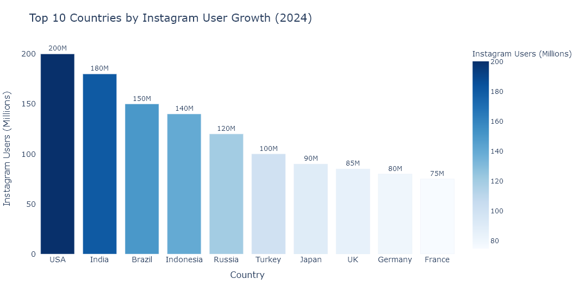
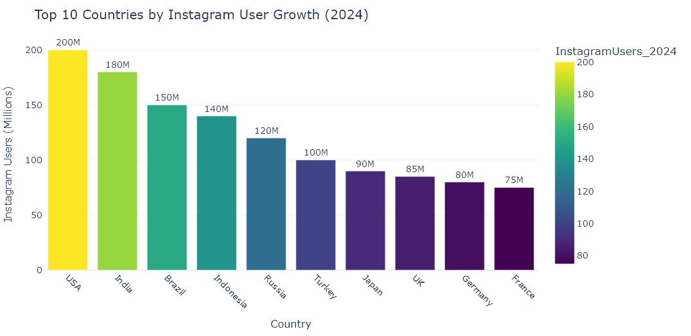

# Instagram User Growth Analysis by Country

This project analyzes Instagram user growth across different countries using data from Kaggle. It includes:

1. **Data Loading**: Downloads the dataset from Kaggle.
2. **Growth Analysis**: Calculates growth rates for Instagram users by country.
3. **Visualization**: Interactive bar plots of the top 10 countries by Instagram user growth in 2024.
4. **Prediction**: Predicts Instagram user growth for a hypothetical country using linear regression.

## Features

- **Interactive Visualizations**: Powered by Plotly.
- **Linear Regression Model**: Predict Instagram user growth using historical data.

## Getting Started

1. Clone the repository:
    ```bash
    git clone https://github.com/yourusername/instagram-growth-analysis.git
    cd instagram-growth-analysis
    ```

2. Install dependencies:
    ```bash
    pip install -r requirements.txt
    ```

3. Run the script:
    ```bash
    python main.py
    ```

## Dataset

The dataset is sourced from Kaggle:
[Instagram User Growth by Country](https://www.kaggle.com/arpitsinghaiml/instagram-user-growth-by-country)

## Visualizations




## Prediction Example

- Input: 
    ```python
    InstagramUsers_2024: 1,000,000
    InstagramUsers_PctFemale_2024: 30
    InstagramUsers_PctMale_2024: 70
    InstagramUsers2023: 800,000
    ```
- Output: `Predicted number of Instagram users: [1,200,000]`

## License

This project is licensed under the MIT License.
